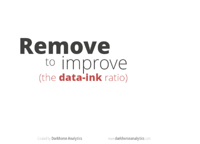

2013-11-02 Reflection
=====================

**He Ma     SID:22348372**

**What we did this week:**  
I'm pretty happy that we have the new groups formed so that we can start on the final project. Through this week's lecture, and thanks a lot to Carl, I now have an idea about what we are going to do. We need to first reproduce Leon's results and then try to improve the prediction function, which means that we will have to use the same, or similar at least, method as Leon for or project. What concerns me now is that we need more detailed instruction on the project itself and division of work. More specifically:   
- What data source are we going to use? Are we using the same earthquake feed as the previous project?  
- which area are we going to examine on? For earthquake prediction, the range should influence the prediction factors.  
- What's the vertical and Horizontal groups' role? Seems like each of our vertical groups is going to work on it's own project. In this case, each group should do the data curation and analysis for their own project, which is not the case.  
- What's kind of tools are we going to use? Since this project is going to be pretty big, I don't think iPython Notebook would be a good tool if we want to split the project into different files performing different taskes. Also we might need to do cross validation, MLK or other STAT models to test the goodness of fit of our model, which we want them to run the the background for a long time. Using iPython Notebook is not a good idea for this case either. 

I'm so happy that my group has all the skills required for the project, and we have worked with each other either for the project or during the lecture for some time in this class. So I'm really looking forward to starting on the project.  
Also a gif I really like that I want to share:  

